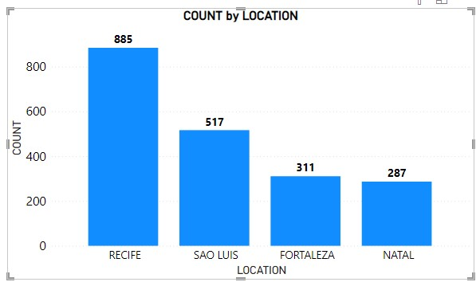
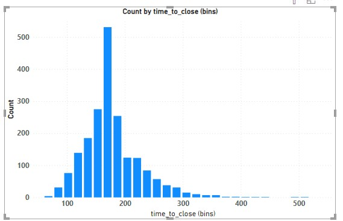
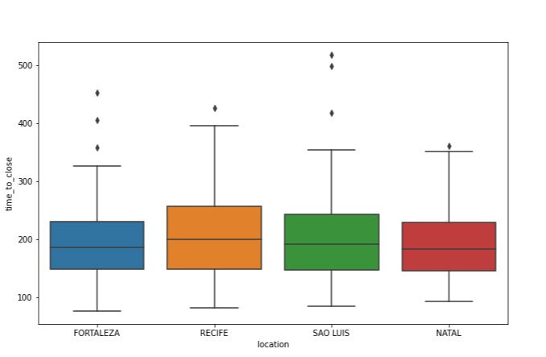
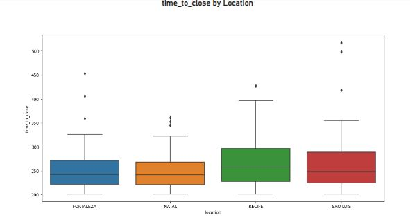

# food_claims_analysis_report❤
## This report was done using Ms Excel, SQL, Power BI and Python Seaborn library
## Data Validation
For every column in the data:
 a. State whether the values match the description given in the table above. 
b. State the number of missing values in the column. 

c. Describe what you did to make values match the description if they did not match.

The original data has 2000 rows and 8 columns. The details below described what was done on each column:

The first column, claim_id is according to the description given and no missing values as all rows had unique identifiers.

The second column time_to_close has discrete values as described and there were no missing values.

The third column claim_amount is a string data type and its different from the description specified. No missing values found. The data type can only be changed at the data source point.

The fourth column which is amount_paid is a continuous numeric data type as described but had 36 missing values. These missing values were replaced with the overall median amount paid(19,702.67).

The fifth column which is location has no missing values and it’s the same as described.

The sixth column, individauls_on_claim attributes were discrete as described and there were no missing values.

The seventh column, linked_cases has nominal data type but had 26 missing values and they were replaced with ‘FALSE’ as instructed.

The eighth column called cause has no missing values and has nominal values as described.
 ## Data Discovery & Visualization 
 - Create a visualization that shows the number of claims in each location. Use the visualization to: 
 - a. State which category of the variable location has the most   observations 
 - b. Explain whether the observations are balanced across categories of the variable location

What is the most common location?
- There are Four locations in the data which are RECIFE, SAO LUIS,FORTALEZA and NATAL. 
The location with the highest number of claims is RECIFE, with SAO LUIS being second although with slightly above half the amount of claims at RECIFE.
- FORTALEZA comes third and followed by NATAL with the lowest count of claims. 
- This should suggest that the legal team should focus on RECIFE as it has more claims but we have to look further.
 
- RECIFE IS THE MOST COMMON LOCATION
 
 
 ## Distribution of Time_to_close for all claim
- Determining the time_to_close distribution is key as the legal team thinks that the number of claims a place gets will be important. 

- Observing all time_to_close , we can see that most places have had less than 200 days of time_to_close .
There are some few outliers that get more than 400 days of time to close. 
When looking for places that have high time_to_close the team should aim for locations having over 200 days of time to close.
 Range in Number of time_to_close
 

##  4.Distribution of Time_to_close for all claims 
 
-  Describe the relationship between time to close and location. Your answer must
- include a visualization to demonstrate the relationship.

- ### Range in the number of time_to_close by location type

So far we have see that RECIFE has the highest number of claims and that most locations have less than 200 days of time_to_close claims.
Finally, we want to know how location type impacts time_to_close. We would first of all look at the entire values of time_to_close for all locations.

From the boxplot below, RECIFE has the highest interquartile range and closely followed by SAO LUIS. FORTALEZA coming third and NATAL with the lowest interquartile range.
 - ### Focused on all the attributes of time_to_close
 

 Distribution of Time_to_close for all claims 
 - Secondly, we filtered time_to_close variables to get values above 200 days across all locations. 
 This is to determine whether the values kept increasing or decreasing across all locations.
- From the boxplot below, RECIFE still has the highest interquartile range,
implying that RECIFE not only has the highest number of claims but also the higest number of time-to-close claims above 200 days.
- This is followed by SAO LUIS with second highest interquartile range. Then FORTALEZA coming third and NATAL with lowest interquartile range.
- ### Focused on time_to_close above 200 days
 
 
 # Recommendations
 Based on all of the above, RECIFE has the highest number of claims with the highest number of time to close claims and it is closely followed by SAO LUIS.

FORTALEZA comes third in the list and NATAL with the lowest number of claims and time to close claims.

The Vivendo legal team should give more attention to RECIFE and SAO LUIS as both locations have more claims with time to close of over 200 days.
 

